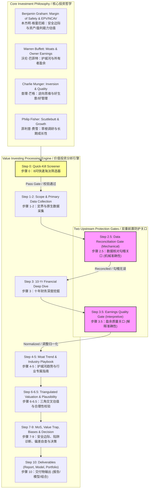
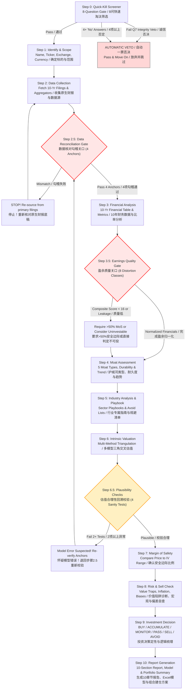
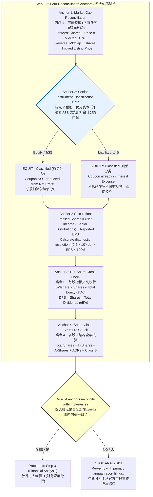
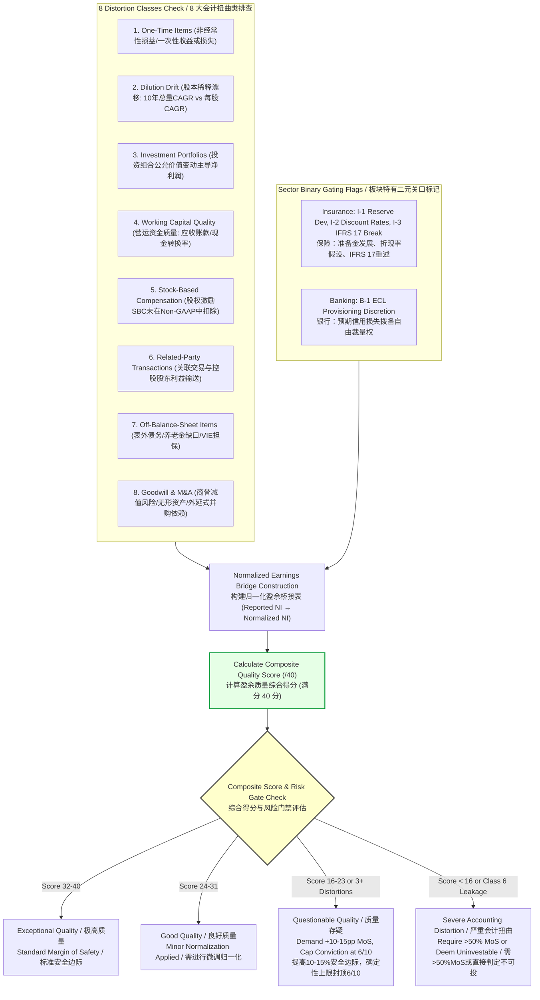
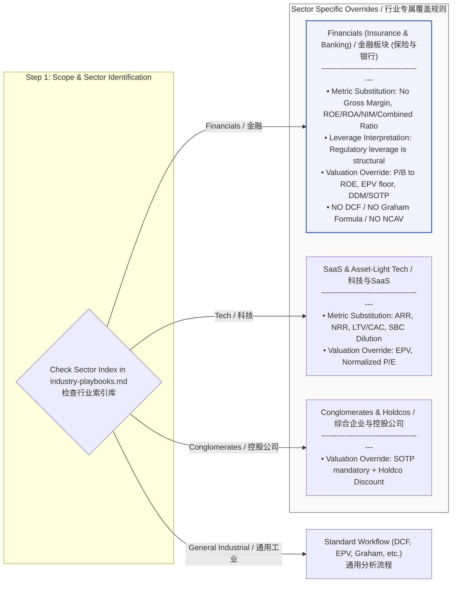
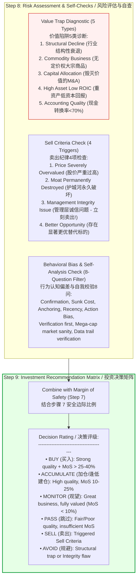
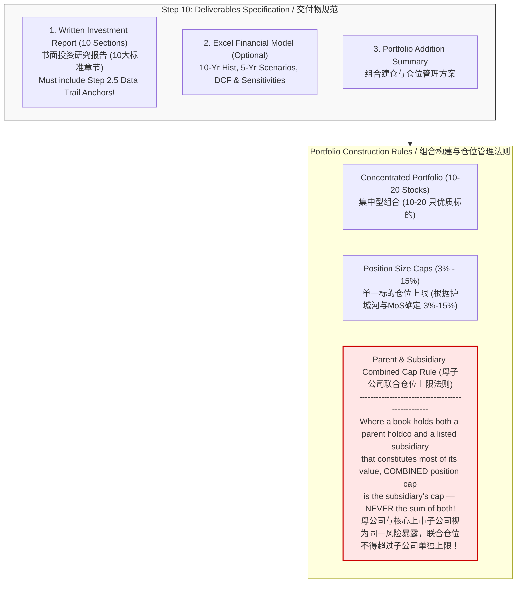

# Value Investing Skill Architecture & Workflow Specification
# 价值投资 Research Skill 架构与工作流程图解指南 (中英双语版)

> **Document Version**: 2026-07-27 (Post-Amendment #13 & 2026-07-26 Sweep Validation)  
> **Target Skill**: `value-investing`  
> **Core Philosophy**: Benjamin Graham, Warren Buffett, Charlie Munger, Philip Fisher

---

## 1. System Architecture & Core Philosophy / 系统架构与核心哲学

The `value-investing` skill is built upon a fundamental principle: **protect downstream valuation and decision-making by enforcing strict upstream data integrity and quality gates**.

本技能的核心设计理念为：**通过设立严密的上游数据勾稽与盈余质量关口，确保下游的估值模型与投资决策建立在真实、未受扭曲的基础之上**。



---

## 2. End-to-End 11-Step Research Workflow / 端到端 11 步研究流程

The standard research procedure consists of 11 sequential steps (Steps 0 through 10). Step 2.5 and Step 3.5 act as mandatory circuit breakers.

标准研究流程分为 11 个步骤（步骤 0 至 10）。其中步骤 2.5 与步骤 3.5 作为强强制熔断关口。



---

## 3. Upstream Protection Gates Detailed Flow / 双重前置防护关口详细流程

### 3.1 Step 2.5: Mechanical Data Reconciliation Gate / 机械数据勾稽关口

Step 2.5 protects against data aggregator errors, dual-listing price-basis traps, and hybrid capital distortions.

步骤 2.5 专门用于防范第三方数据源错误、双重上市价格基准陷阱以及混合资本结构（永续债/AT1）导致的股本扭曲。



---

### 3.2 Step 3.5: Earnings Quality Gate & 8 Distortions / 盈余质量关口与 8 大扭曲类

Step 3.5 transforms accounting numbers into true **Economic Owner Earnings**.

步骤 3.5 将会计层面披露的净利润转换为反映商业本质的**经济所有者盈余**。



---

## 4. Sector Playbook Override & Early Loading Logic / 行业专属指南覆盖逻辑

The skill automatically detects company sector in **Step 1** and loads specialized metrics and valuation method overrides from `references/industry-playbooks.md`.

技能在**步骤 1**识别公司行业后，会自动提前载入 `references/industry-playbooks.md` 中的专属指标与估值模型覆盖逻辑。



---

## 5. Triangulated Valuation & Plausibility Feedback Loop / 估值三角交叉与合理性校验闭环

Step 6 executes valuation calculations using at least two independent methods, followed by Step 6.5 sanity checks. If an error is detected, the flow loops back to reconciliation.

步骤 6 使用至少两种独立方法进行三角估值，随后在步骤 6.5 进行 4 项合理性反向校验。若检测出异常，流程将自动回溯至勾稽关口。

```mermaid
flowchart TD
    subgraph Step6_Valuation ["Step 6: Triangulated Intrinsic Valuation / 多模型三角交叉估值"]
        M1["1. Owner Earnings DCF (Buffett)<br>所有者盈余现金流折现"]
        M2["2. Earnings Power Value - EPV (Greenwald)<br>零增长盈利能力价值"]
        M3["3. Graham Formula (Graham)<br>格雷厄姆经典公式"]
        M4["4. Dividend Discount Model - DDM<br>股息折现模型"]
        M5["5. Asset-Based / NCAV (Graham)<br>净清算资产估值"]
        M6["6. Sum-of-the-Parts - SOTP<br>分部加总估值 (Holdcos)"]
    end

    Step6_Valuation --> Range["Establish Intrinsic Value Range<br>建立内在价值区间 (Conservative / Base / Optimistic)"]

    subgraph Step65_Plausibility ["Step 6.5: Output Plausibility Sanity Tests / 估值合理性4项校验"]
        T1["Test 1: 'Too Good to Be True'<br>大盘蓝筹股 MoS > 40% 须极度审慎并找出差异主因"]
        T2["Test 2: Peer Multiple Cross-Check<br>隐含乘数 (P/E, EV/EBITDA, P/B) 与同业中位数对比"]
        T3["Test 3: Reverse DCF<br>反向 DCF 求解当前股价隐含的永续增长率"]
        T4["Test 4: Analyst Consensus Divergence<br>与卖方共识估值偏离 > 50% 必须有明确可防御假设"]
    end

    Range --> Step65_Plausibility

    Step65_Plausibility --> SanityCheck{"Fails 2+ Plausibility Tests?<br>是否触发 2 项以上校验异常？"}
    
    SanityCheck -->|YES (Failure) / 是 (异常)| LoopBack["SUSPECT MODEL ERROR!<br>Loop back to Step 2.5 Reconciliation Gate<br>怀疑数据或模型错误！退回步骤 2.5 重查底稿"]
    LoopBack -->|Re-verify Anchors| Step25_Ref["Step 2.5: Data Reconciliation Gate"]
    
    SanityCheck -->|NO (Passed) / 否 (合理)| Step7_MoS["Step 7: Margin of Safety Gate<br>进入步骤 7：安全边际确认"]

    style Step65_Plausibility fill:#fff7e6,stroke:#ff9900,stroke-width:2px
    style SanityCheck fill:#ffffcc,stroke:#333,stroke-width:2px
    style LoopBack fill:#ffe6e6,stroke:#cc0000,stroke-width:2px
```

---

## 6. Risk Assessment, Behavioral Bias Check & Decision Matrix / 风险评估、偏差自查与决策矩阵

Step 8 screens for value traps and cognitive biases before finalizing the rating in Step 9.

步骤 8 在步骤 9 输出最终评级前，对 5 类价值陷阱、宏观风险及 8 项认知偏差进行自我审查。



---

## 7. Deliverables Generation & Portfolio Construction Sub-Workflow / 交付物生成与组合构建子流程

Step 10 formats findings into a 10-section markdown report, optional 12-tab Excel model, and portfolio position sizing.

步骤 10 将分析成果规范化输出为 10 章节 Markdown 研究报告、可选的 12 标签页 Excel 估值模型以及投资组合仓位管理方案。



---

## Summary of Core Principles / 核心原则总结

1. **Reconcile Before You Analyze (先勾稽，后分析)**: Step 2.5 takes 5 minutes and prevents the vast majority of critical errors.
2. **Normalize Before You Value (先归一化，后估值)**: Step 3.5 bridges accounting earnings to economic owner earnings.
3. **Placing Upstream Gates (双关口护航)**: Upstream gates safeguard downstream valuation from "garbage in, garbage out".
4. **Per-Share Economics Over Aggregates (每股价值高于总量增长)**: Dilution drag matters to existing shareholders.
5. **Parent & Subsidiary Risk Aggregation (母子公司合并风险敞口)**: Treat parent and major listed subsidiary as a single exposure.
